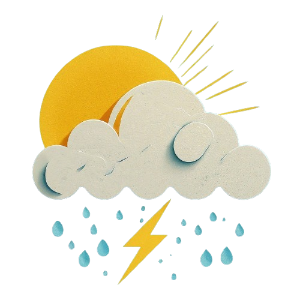

# Wetter.io

Wetter.io is a weather application that fetches data using the OpenWeatherMap API to provide users with accurate and up-to-date weather information.



## Table of Contents

- [Wetter.io](#wetterio)
  - [Table of Contents](#table-of-contents)
  - [Introduction](#introduction)
  - [Features](#features)
  - [Installation](#installation)
  - [Usage](#usage)
  - [Contributing](#contributing)
  - [Author](#author)
  - [License](#license)

## Introduction

Wetter.io is a weather application designed to provide users with real-time weather data from OpenWeatherMap. It offers a user-friendly interface to access weather information conveniently.

## Features

- Real-time Weather Data: Fetches and displays current weather conditions.
- 5-Day Forecast: Provides a 5-day forecast for a detailed weather outlook.
- Hourly Forecast: Shows hourly weather forecasts throughout the day.
- Air Quality Information: Displays air pollution details for the specified location.

## Installation

To install Wetter.io, follow these simple steps:

```bash
# Clone the repository
git clone https://github.com/yourusername/wetterio.git

# Navigate to the project directory
cd wetterio

# Install dependencies
npm install
```

## Usage

To use Wetter.io, follow these steps:

```bash
# Run the application
npm start
```
Visit http://localhost:3000 in your web browser to access the application.

## Contributing

If you would like to contribute to Wetter.io, please follow our Contribution Guidelines.

1. Fork the Repository:

Fork the Wetter.io repository to your GitHub account.

2. Clone the Repository:

Clone your forked repository to your local machine using the git clone command.

```bash
git clone https://github.com/your-username/Wetter.io.git
```
3. Create a Branch:

Create a new branch for your contribution. Use a descriptive name for your branch.

```bash
git checkout -b feature-name
```
4. Make Changes:

Make the necessary changes to the code or add new features.

Commit Changes:

Commit your changes with a clear and concise commit message.

```bash
git add .
git commit -m "Add feature-name"
```
6. Push Changes:

Push your changes to your forked repository.

```bash
git push origin feature-name
```

7. Create a Pull Request (PR):

Create a new Pull Request on the Wetter.io repository.
Provide a descriptive title and summary of your changes in the PR.

8. Review and Merge:

Wait for the maintainers to review your PR.
If there are no conflicts and your changes are approved, your PR will be 

9. Sync with Upstream (Optional):

Keep your forked repository in sync with the upstream (original) repository by regularly pulling the latest changes.

```bash
git remote add upstream https://github.com/original-repo/Wetter.io.git
git fetch upstream
git checkout main
git merge upstream/main
```

10. Celebrate:

Congratulations! You've successfully contributed to Wetter.io. Thank you for your contribution!

## Author

- [NEAZYIT](https://github.com/NEAZYIT)
- [nadaAit11](https://github.com/nadaAit11)
  
## License

MIT License

Copyright (c) [2024] [NEAZYIT] & [nadaAit11] 

Permission is hereby granted, free of charge, to any person obtaining a copy
of this software and associated documentation files (the "Software"), to deal
in the Software without restriction, including without limitation the rights
to use, copy, modify, merge, publish, distribute, sublicense, and/or sell
copies of the Software, and to permit persons to whom the Software is
furnished to do so, subject to the following conditions:

The above copyright notice and this permission notice shall be included in all
copies or substantial portions of the Software.

THE SOFTWARE IS PROVIDED "AS IS", WITHOUT WARRANTY OF ANY KIND, EXPRESS OR
IMPLIED, INCLUDING BUT NOT LIMITED TO THE WARRANTIES OF MERCHANTABILITY,
FITNESS FOR A PARTICULAR PURPOSE AND NONINFRINGEMENT. IN NO EVENT SHALL THE
AUTHORS OR COPYRIGHT HOLDERS BE LIABLE FOR ANY CLAIM, DAMAGES OR OTHER
LIABILITY, WHETHER IN AN ACTION OF CONTRACT, TORT OR OTHERWISE, ARISING FROM,
OUT OF OR IN CONNECTION WITH THE SOFTWARE OR THE USE OR OTHER DEALINGS IN THE
SOFTWARE.